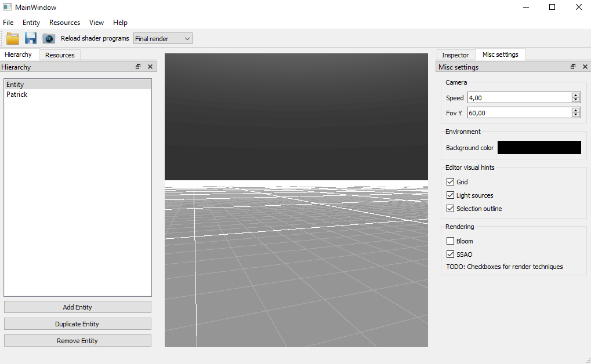
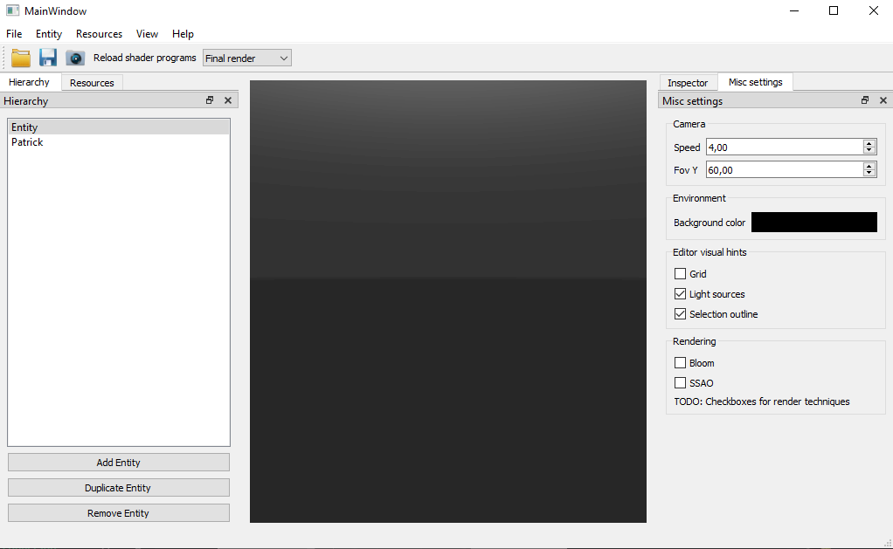
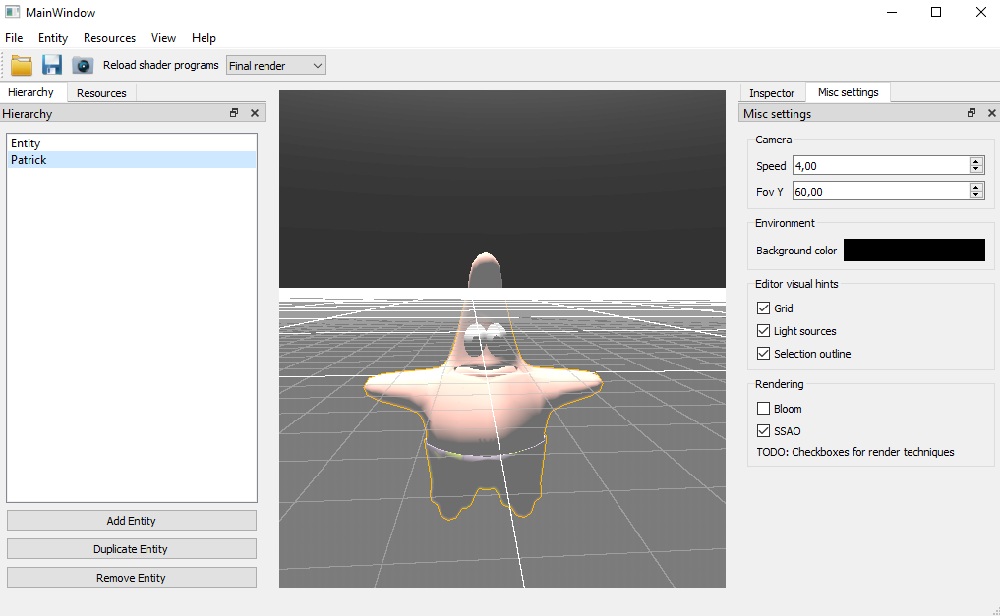
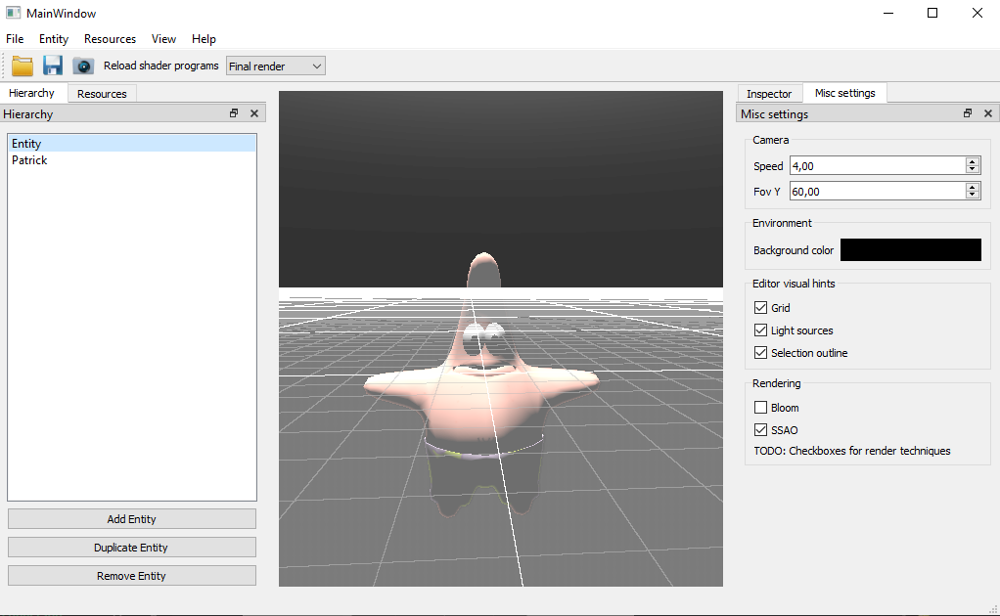
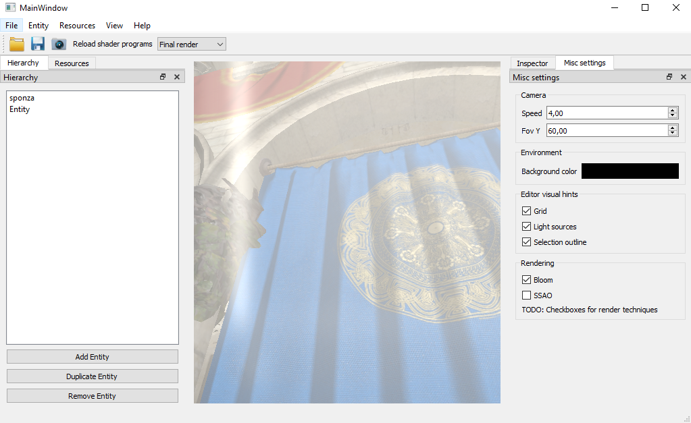
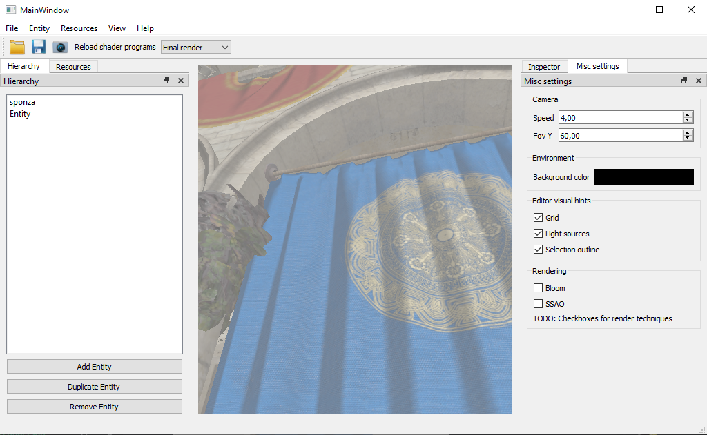
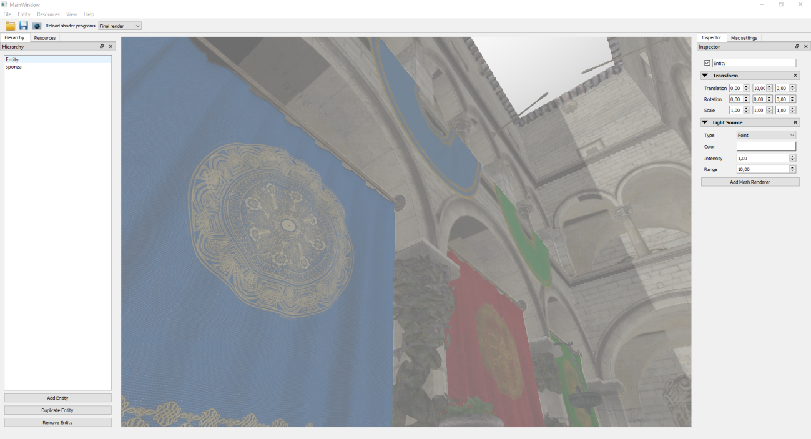
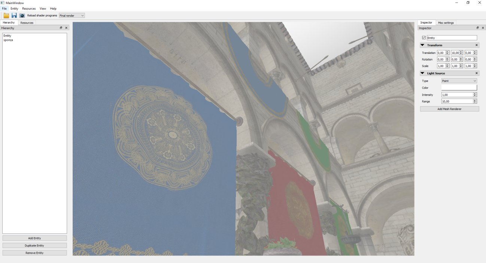
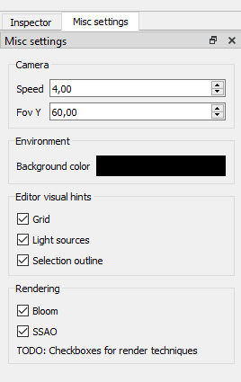

# Cotxe11 engine
 
Cotxe11 engine is a model viewer engine used to make various shaders, made by Manel Mourelo, Alfonso Sánchez & David Valdivia for the "Advanced Graphics Programming" subject in our university.

## Viewport Navigation
- Select an object in the scene by **left clicking** it in the viewport.
- Look arround the viewport by clicking the **right button of the mouse** and moving it wherever you want to look.
- Orbit arround a selected object by moving the mouse with the **Z key** and the **right mouse button** both clicked.
- To freely navigate arround the scene press the **right button on the mouse** and press:
  - **W**: Move forward
  - **S**: Move backward
  - **A**: Move left
  - **D**: Move right
  - **E**: Move up
  - **Q**: Move down

## Implemented shaders
We've implemented the next selection of shaders:

### Grid
The grid in the engine is procedurally generated with a shader that generates an infinite grid.

### Background
The background of the engine is printed using a shader that distinguishes the colors bettween the floor and the walls of the engine.

### Mouse picking
Mouse picking is the process of selecting the object that is picked with the mouse button. This process to pick a certain object is using object identifiers on a texture via a shader.

### Outline shader
An outline that envelops the currently selected model. In the following images it can be seen a 3D model with and without the outline.

  

### Bloom
The bloom shader is a shader that gives brightly lit parts of an object or the scene an intense glowing effect that really accentuates the brightness of the scene elements. In the following images it can be seen a 3D scene that utilizes the bloom technique and one that doesn't.

 

### SSAO
SSAO, abbreviation of **Screen Space Ambient Occlusion** is a shader that applies ambient occlusion to the scene objects in real time. In the following images it can be seen a 3D scene that utilizes the SSAO technique and one that doesn't.

  

## Configuration options
Every shader except for the background can be enabled and disabled with some checkboxes in the "Misc Settings" tab in the Inspector window. The color of the background can also be changed there.

